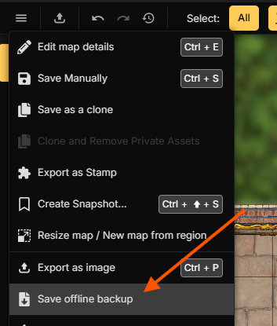

#  Brickwork

## For Users

Brickwork is a tool that helps you to get battlemaps created in Inkarnate into
FoundryVTT, without having to recreate walls there. Brickwork opens an offline
backup .ink file from Inkarnate, extracts wall metadata, allows you to quickly
adjust wall types and exact positioning. You can then export the map to
FoundryVTT.

Brickwork also supports importing from and to .uvtt (also known as .dd2vtt and
.df2vtt). When exporting to .uvtt, the various Foundry wall types are mapped
down to the more restrictive .uvtt types.

### Usage

1. Download the Brickwork binary for your OS from the releases
2. Save an Inkarnate Backup.
   
3. Open the .ink file in Brickwork
4. Adjust wall types by clicking or dropdown, disable walls by middle-clicking,
   adjust wall position and gaps/doors by click-and-drag.
5. Export to .vtt, select FoundryVTT as target
6. In Foundry, create a new Scene, right-click -> Import. Select the .json file
   created by Brickwork. 
7. Now, set the Background image as normal, selecting the Inkarnate export.

### FAQ

**Q**: Windows says this software is dangerous!

**A**: It does say that. It's safe to click the `Run Anyway` button. I just
haven't yet decided to swallow the cost of buying the "Trusted Publisher"
status. If Brickwork gets decent feedback and sees actual use, I might.

----

**Q**: Why doesn't the export contain the background image, even though I can see
it in Brickwork?

**A**: Brickwork uses a low-resolution preview image embedded in the Inkarnate
backup. On most maps, this is not sufficient for good gameplay, and you should
use the full-resolution export from Foundry instead.

----

**Q**: Can you add support for...
**A**: Probably? I have plans to continue work on this. First, I want to expand
what can be done with walls: deleting, adding and rerouting instead of just
nudging. In this way, Brickwork could serve as a generic Wall Creation Tool even
without .ink or .uvtt files. I also want to look into supporting lights in
addition to walls. I have other ideas, but they are vague and depend on feedback.

If you want me to support a different .vtt as an export target or a different
mapmaking tool as an input, absolutely also reach out. There might be some
difficulty if those are pay-to-use, but there's a good chance we can figure
something out.

----

**Q**: Isn't this just AI Slop?

**A**: This project was indeed created with heavy usage of LLM-driven coding tools.
I am a professional software developer - I could have implemented every
individual part of this application myself, but probably never would have found
the free time to do it without AI coding tools. Even so, I've spent several days
of full-time work on searching for existing solutions, finding a technical
approach to getting wall data from Inkarnate, checking for edge-cases, bugs,
awkward interactions and applying lots of polish until it felt great to use.

I have intensely validated a complete flow from Inkarnate through Brickwork into
FoundryVTT and polished the flow carefully to make this a piece of software that
truly helps me.

If you think I should approach this tool, or other work for the PnP-Community,
with my full professional standards instead of hobbyist standards, I'll be happy
to talk about doing freelance work for or with you. 😉


## For Developers

### Prerequisites

- [.NET 10 SDK](https://dotnet.microsoft.com/download/dotnet/10.0) (run `just setup-repo` on Windows to install automatically)

### Build

From `converter/` (requires [just](https://github.com/casey/just)):

```bash
just recompile
```

Or with `dotnet` directly:

```bash
dotnet build converter/Brickwork.sln
dotnet test converter/Brickwork.sln
```

### Run (GUI)

```bash
cd converter && just gui
```

Open an Inkarnate `.ink` backup, preview wall overlays, edit walls, and use **Export to VTT** (Foundry JSON).

### Run (CLI)

```bash
cd converter && just cli convert -i ../resources/test-maps/empty-backup.ink -o output.json -f foundry
cd converter && just cli analyze -i ../resources/test-maps/empty-backup.ink
cd converter && just cli analyze -i ../resources/test-maps/empty-backup.ink --summary
```

CLI export formats: `foundry`, `uvtt1`

### Releases

Create a release from GitHub Actions → **Release** → Run workflow, and enter a version such as `0.1.0-beta.1`.

Builds are published for Windows, Linux, and macOS (x64 and arm64).